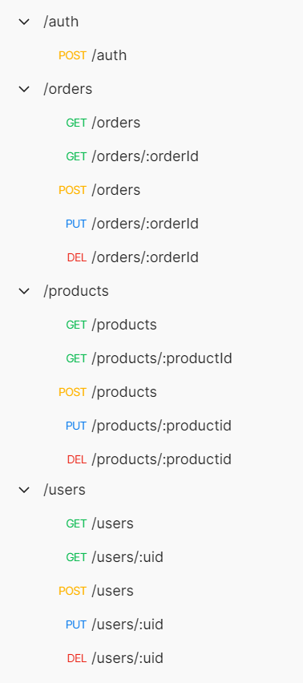

# Burger Queen - API con Node.js

## Índice

* [1. Introducción](#1-Introducción)
* [2. Resumen del proyecto](#2-resumen-del-proyecto)
* [3. Endpoints](#3-endpoints)
* [4. Cli](#4-cli)
* [5. Despliegue (Deployment)](#Despliegue)

## 1. Introducción

Un pequeño restaurante de hamburguesas, que está creciendo, necesita un
sistema a través del cual puedan tomar pedidos usando una _tablet_, y enviarlos
a la cocina para que se preparen ordenada y eficientemente.

Este proyecto tiene dos áreas: interfaz web (cliente) y API (servidor). Nuestra
clienta nos ha solicitado desarrollar la API que se debe integrar con la
interfaz, que otro equipo de desarrolladoras está trabajando simultáneamente.


## 2. Resumen del proyecto


Con una API en este caso nos referimos a un _servidor web_, que es
básicamente un programa que _escucha_ en un puerto de red, a través del cual
podemos enviarle _consultas_ (_request_) y obtener _respuestas_ (_response_)
usando el protocolo HTTP (o HTTPS).

Un servidor web debe _manejar_ consultas entrantes y producir respuestas a esas
consultas que serán enviadas de vuelta al _cliente_. Cuando hablamos de
_aplicaciones de servidor_, esto implica una arquitectura de _cliente/servidor_,
donde el cliente es un programa que hace consultas a través de una red (por
ejemplo el navegador, cURL, ...), y el _servidor_ es el programa que recibe
estas consultas y las responde.

La clienta nos ha dado un [link a la documentación](https://laboratoria.github.io/burger-queen-api/)
que especifica el comportamiento esperado de la API que expondremos por
HTTP. Ahí puedes encontrar todos los detalles de qué _endpoints_ debe
implementar la aplicación, qué parámetros esperan, qué deben responder, etc.


## 3. Endpoints

La aplicación incluye middlewares de autenticación y control de errores. Requiere un usuario administrador y autenticación para acceder a las rutas. 



## 4. CLI

La aplicación arranca con el comando **`npm start`** y que puede
recibir información de configuración, como el puerto en el que escuchar, a qué
base datos conectarse, etc. 

#### 4.1 Argumentos de línea de comando

Podemos especificar el puerto en el que debe arrancar la aplicación pasando un
argumento a la hora de invocar nuestro programa:

```sh
# Arranca la aplicación el puerto 8888 usando npm
npm start 8888
```


## 5. Despliegue (Deployment)

El despliegue se realizó con Heroku visible en el siguiente enlace: https://burger-queen-api-reg.herokuapp.com/

Base de datos utilizada, `MongoDB`.